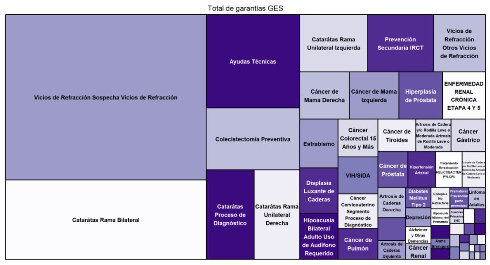
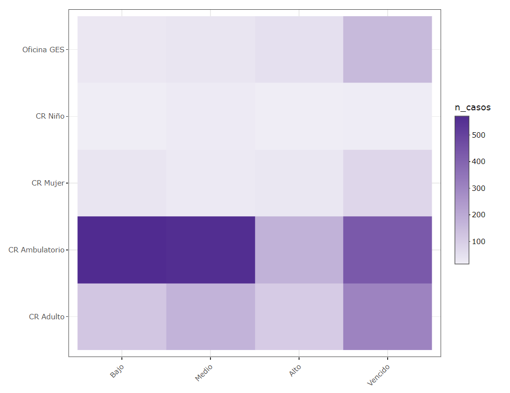

# Reporte garantías GES

Reporte automático del estado de garantías GES (Garantías Explícitas en Salud) para instituciones públicas de salud en Chile.

## :green_circle: Ventajas:

-   Reporte automatizado

-   Aplica para cualquier institución pública de salud en Chile

-   Solo requiere de 2 listados básicos descargables desde SIGGES

-   Utiliza un modelo de [categorizacion de riesgo de vencimiento](http://opensaludlab.blogspot.com/2016/12/aplicacion-de-metodologia-lean-en-la.html)

-   Fácilmente personalizable

-   Facilita el análisis y comunicación de datos

## :red_circle: Desventajas:

-   Requiere conocimientos en R Markdown (básicos)  

# :construction_worker: Uso

1.  Clona este repositorio en tu repositorio local

2.  Descarga las garantías vigentes y retrasadas desde SIGGES

3.  Guarda los archivos en la carpeta `/data_raw` ([sigue estas recomendaciones](https://github.com/paulovillarroel/reporte_GES/blob/main/data_raw/Notes.txt))

4.  Ajusta el archivo `/tables/listado_etapas_GES.xlsx` a tus necesidades

5.  Abre el proyecto `reporte_GES` en RStudio

6.  Knit `reporte.Rmd` con salida HTML  

## :star: Novedades

24-nov-21:

-   Se agregan gráficos de tendencia con media móvil semanal

-   Se ajusta el índice

20-nov-21:

-   Arreglo algunos elementos gráficos

-   Agrego una descripción a varios gráficos

18-nov-21:

-   Arreglo algunos bugs

-   Agrego gráfico resumen de garantías retrasadas por etapa asistencial

17-nov-21:

-   Se agregan varios gráficos para analizar la tendencia de la evolución de las garantías retrasadas

-   Se agrega como salida la generación de listados con las clasificaciones usadas en el reporte

-   Se mejoran algunos elementos de color

## :framed_picture: Screenshots

El reporte incluye una serie de gráficas y resúmenes estadísticos, basados en la información GES.

El reporte contiene más de 12 gráficos y diversas tablas de datos interactivas.

Ejemplos:

*Gráfica general de garantías:*

*Gráfica por unidad funcional:*

## 

## :raising_hand: Contribuciones

Si encuentras errores en el código o quieres agregar nuevas funcionalidades, definitivamente eres bienvenido/a a crear un Pull Request para mejorar el reporte.

Considera [crear una `issue`](https://github.com/paulovillarroel/reporte_GES/issues) si encuentras algo o tienes alguna duda.
