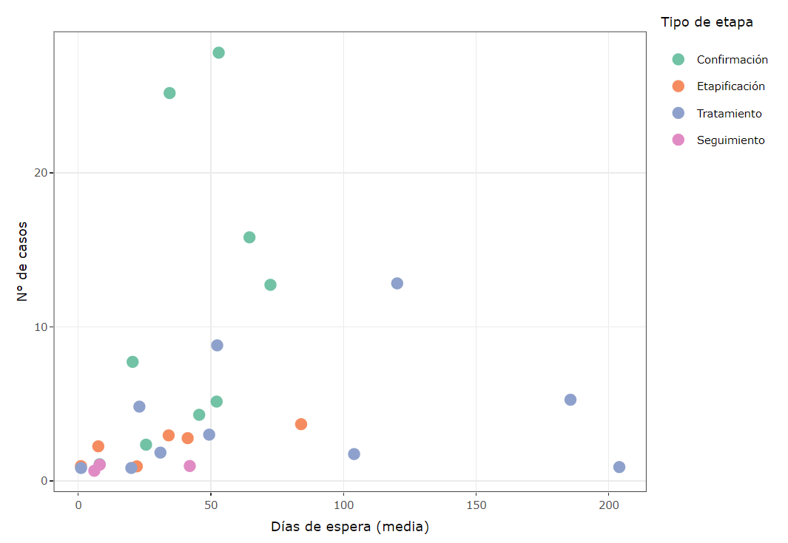

# Reporte garantías GES

Este es el repositorio del reporte del estado de garantías GES (Garantías Explícitas en Salud) para Chile.

## :green_circle: Ventajas:

-   Reporte automatizado

-   Aplica para cualquier institución pública de salud de Chile

-   Solo requiere de los listados de garantías vigentes y retrasadas (SIGGES)

-   Utiliza un modelo de [categorizacion de riesgo de vencimiento](http://opensaludlab.blogspot.com/2016/12/aplicacion-de-metodologia-lean-en-la.html)

-   Fácilmente personalizable

-   Facilita el análisis y comunicación de datos

## :red_circle: Desventajas:

-   Requiere conocimientos en R Markdown (básicos)

## Screenshots 

El reporte incluye una serie de gráficas y resúmenes estadísticos, basados en la información GES.

El reporte contiene más de 12 gráficos y diversas tablas de datos interactivas.

Gráfica general de garantías:

Gráfica por unidad funcional:

Gráfica de tiempos de espera:

